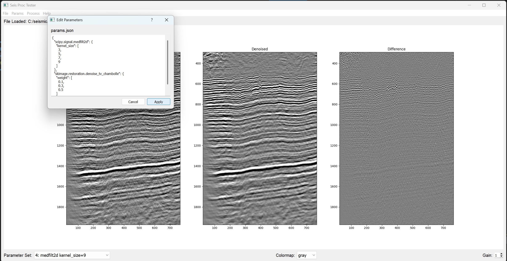

# SeisProcTestPy
### Version 1.0

Программа для тестирования обрабатывающих процедур для файлов в формате SEG-Y.

## Основные возможности:

- Загрузка/экспорт 2D сейсмических данных в формате SEG-Y
- Визуализация данных с настройкой цветовых карт и усиления
- Обработка заданных сочетаний параметров с использованием пользовательских алгоритмов
- Можно использовать любую процедуру из любой доступной python библиотеки, принимающую на вход 2D ndarray и набор параметров
- Сравнение оригинальных и обработанных данных
- Интерактивный зум с помощью мыши (выделение области - ЛКМ, сброс зума - ПКМ)

## Ограничения:

- Загружает сразу все трассы, поэтому подходит для сейсмических разрезов или для единичных сейсмограмм
- Реализация на python накладывает ограничения на быстродействие интерфейса. Имеет смысл работать с небольшими файлами
- Редактирование параметров в JSON не очень удобна

## Замечания:
- Перед обработкой данные скалируются на диапазон (0, 1), затем при выводе возвращаются к исходному диапазону

## Технологии:

- PyQt5 (GUI)
- Matplotlib (визуализация)
- Numpy (обработка данных)
- Segyio (работа с SEG-Y)
- Scikit-learn (MinMaxScaler)

© 2025 Сергей Сергеев
